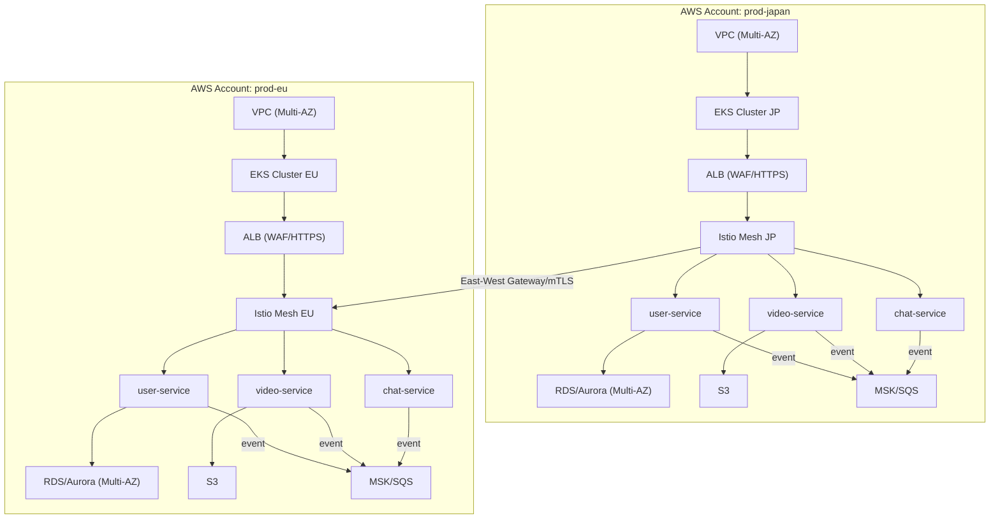
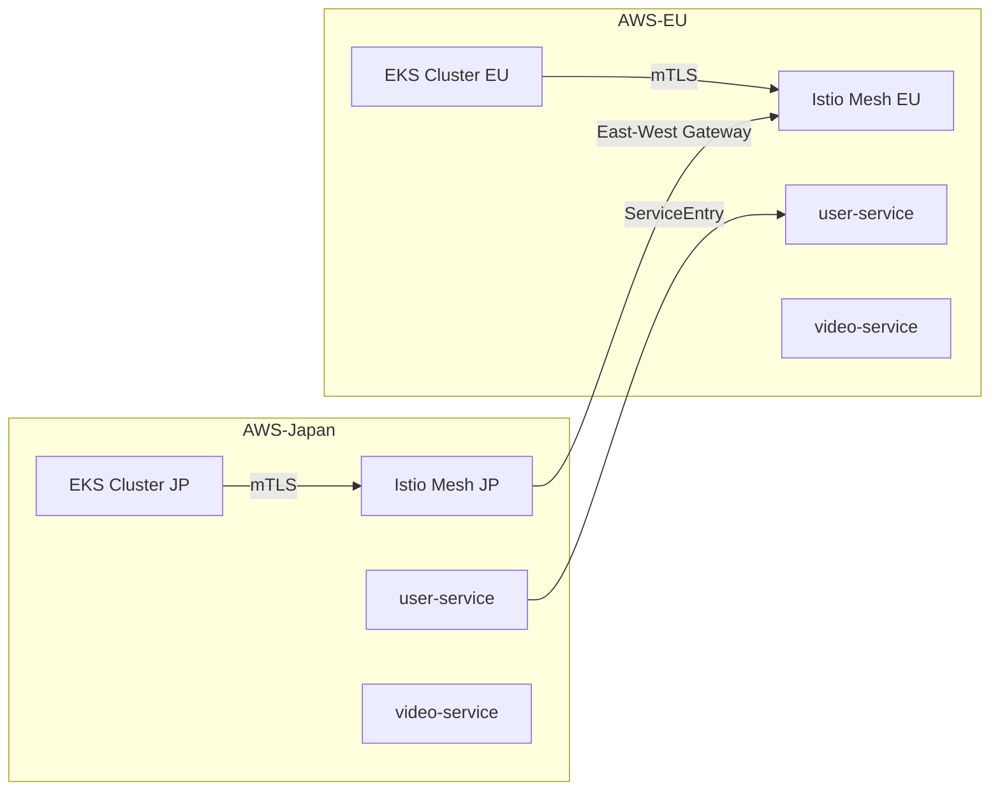
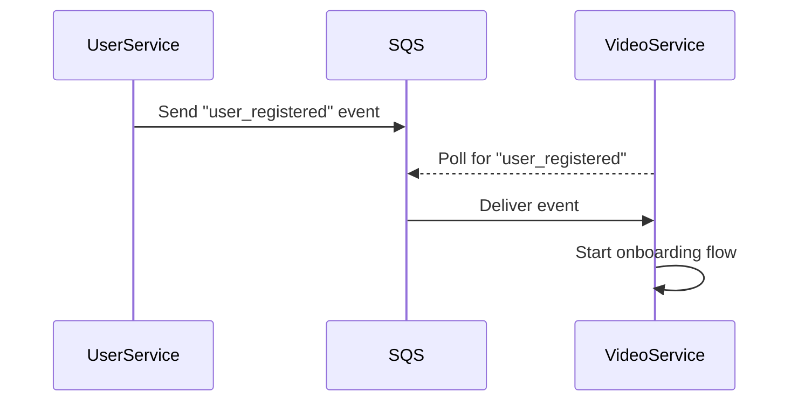
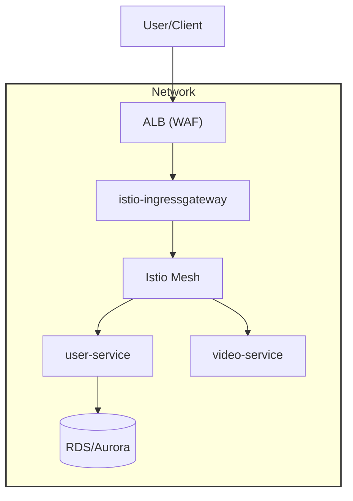

# アーキテクチャ設計・拡張運用 ドキュメント

このドキュメントは、EKS×Istio× マイクロサービス基盤の**現場運用・拡張時に一切迷わないための全設計・運用・拡張方針**を、
**AWS 公式・PCI DSS・現場ベストプラクティスに基づき、具体例・運用フロー・設計理由まで一切省略せず**記述しています。

## 1. システム全体構成・設計思想

### 1.1 全体像

-   **EKS**：AWS マネージド Kubernetes。高可用性・スケール・IAM 連携・AZ 冗長
-   **Istio**：サービスメッシュ（mTLS/認証認可/トラフィック制御/可観測性/レートリミット/サーキットブレーカー/カナリア・A/B テスト）
-   **ALB**：L7 ロードバランサ（HTTPS 終端、WAF 連携、複数ドメイン対応）
-   **ArgoCD**：GitOps デプロイ（宣言的運用、自動同期、ロールバック、マルチクラスタ対応）
-   **OPA/Gatekeeper**：Admission 制御・ガバナンス（Rego/ConstraintTemplate、ラベル必須・特権 Pod 禁止等）
-   **Prometheus/Grafana/Kiali/CloudWatch**：監視・メトリクス・ダッシュボード・トレーシング・アラート・AWS 連携
-   **trivy/kube-bench/kube-linter**：セキュリティ自動化・CIS 準拠・静的解析・脆弱性管理
-   **Terraform/Helm**：IaC（AWS リソース・ミドルウェア・K8s リソースのコード管理、State 分割・Lock 戦略）
-   **Go/Node.js/Python**：Polyglot マイクロサービス（API 設計・テスト分離、責務分離）
-   **CI/CD**：PR 時に全自動 Lint/テスト/セキュリティ/ポリシーチェック、本番は ArgoCD で自動デプロイ

### 1.2 Mermaid 図：物理・論理アーキテクチャ



## 2. マルチクラスタ・マルチアカウント設計

### 2.1 なぜ必要か

-   **可用性・DR**：AZ/リージョン障害時の切替、単一障害点排除
-   **法規制/組織分割**：EU/US/Japan 等の分離、グループ会社ごとにアカウント分割
-   **大規模スケール**：クラスタごとにリソース上限を独立管理、障害ドメイン分離

### 2.2 ディレクトリ・IaC 設計

```plaintext
infra/
  ├── cluster-prod-japan/
  │     ├── terraform/
  │     │   ├── main.tf
  │     │   ├── vpc.tf
  │     │   ├── eks.tf
  │     │   ├── rds.tf
  │     │   ├── s3.tf
  │     │   ├── cloudwatch.tf
  │     │   ├── kms.tf
  │     │   ├── outputs.tf
  │     │   └── README.md
  │     ├── helm/
  │     └── k8s/
  ├── cluster-prod-eu/
  │     ├── terraform/
  │     ├── helm/
  │     └── k8s/
  └── shared/
        ├── cicd/
        └── docs/
```

-   **State ファイルはクラスタ単位で分割、S3+KMS+State Lock で管理**
-   **Helm/K8s マニフェストもクラスタ単位で完全分離**
-   **shared/に共通 CI/CD・ドキュメント・Terraform モジュールを配置**

### 2.3 マルチクラスタ連携設計

-   **Istio Multi-Cluster Mesh**
    -   East-West Gateway、TrustDomain 設計でクラスタ間サービスメッシュ
    -   サービスディスカバリは ServiceEntry/ExternalName/Istio Gateway
-   **AWS アカウント間連携**
    -   Resource Access Manager (RAM)、IAM AssumeRole、VPC Peering/Transit Gateway
-   **監査証跡**
    -   各アカウントで CloudTrail/GuardDuty/SecurityHub を有効化し、CloudWatch Logs/SIEM に集約

#### Mermaid 図：マルチクラスタ構成例



## 3. 環境変数・Secret 管理の多重化

### 3.1 管理戦略

-   **Kubernetes Secret**
    -   各クラスタ/namespace ごとに secret.yaml を分離
    -   Envelope Encryption（KMS 連携）で K8s Secret 自体も暗号化
-   **AWS Secrets Manager / SSM Parameter Store**
    -   クラスタ/環境ごとに Secret 名・パスを分離（例：/prod/japan/db_password, /prod/eu/db_password）
    -   ローテーション設定・アクセス監査も有効化
-   **Sealed Secrets / External Secrets Operator**
    -   GitOps 運用時は暗号化 Secret を Git 管理し、復号はクラスタ内で実施
    -   Secret のローテーション時は自動反映

#### 具体例

```yaml
# cluster-prod-japan/k8s/user-service/secret.yaml
apiVersion: v1
kind: Secret
metadata:
    name: user-service-secret
    namespace: prod
type: Opaque
data:
    DB_USER:
    DB_PASS:
---
# cluster-prod-eu/k8s/user-service/secret.yaml
apiVersion: v1
kind: Secret
metadata:
    name: user-service-secret
    namespace: prod
type: Opaque
data:
    DB_USER:
    DB_PASS:
```

-   **.env.example** もクラスタ/環境ごとにテンプレート分割
-   **Secret ローテーション Runbook**は docs/operations.md に必ず記載

## 4. イベント駆動・非同期通信設計

### 4.1 採用技術・設計

-   **AWS SQS/SNS**：シンプルなキューイング・PubSub 用途
-   **Amazon MSK (Kafka)/RabbitMQ**：高スループット・多 Consumer 用途
-   **K8s ネイティブ（Knative Eventing/KEDA）**：K8s リソースとしてイベント管理
-   **DLQ（デッドレターキュー）設計**：失敗イベントは DLQ に送信、監査・リプレイも設計
-   **AsyncAPI 仕様**：イベントスキーマを AsyncAPI で管理・バージョン管理

#### Mermaid 図：イベント駆動構成例



### 4.2 運用・監査

-   **イベント監査/リプレイ手順**は docs/operations.md に記載
-   **イベントスキーマ変更時は AsyncAPI 定義を必ず更新**

## 5. ゼロトラスト/ネットワーク制御

### 5.1 NetworkPolicy 設計

-   **default-deny の NetworkPolicy を全 namespace で適用**
-   **PodSelector/NamespaceSelector で通信許可範囲を最小化**
-   **VPC Flow Logs/CloudTrail で通信監査**

#### 具体例

```yaml
apiVersion: networking.k8s.io/v1
kind: NetworkPolicy
metadata:
    name: deny-all
    namespace: prod
spec:
    podSelector: {}
    policyTypes:
        - Ingress
        - Egress
```

### 5.2 VPC 設計ベストプラクティス

-   **本番/開発/監査用サブネット分離**
-   **DB や内部サービスは Private Subnet に限定**
-   **SecurityGroup は最小権限原則、Pod Security Group も活用**
-   **Egress Gateway, ACM Private CA 連携で mTLS ルート CA 外部化**

#### Mermaid 図：ネットワーク多層防御



## 6. 可用性・DR・ゾーン/リージョン冗長

### 6.1 AZ/リージョン冗長設計

-   **EKS クラスタは必ず Multi-AZ 構成**
-   **RDS/Aurora も Multi-AZ、リードレプリカ、フェイルオーバー設計**
-   **ALB は複数 AZ で自動分散**
-   **Istio Gateway/Ingress も複数 AZ にデプロイ**
-   **AZ 障害時の自動復旧（ゾーンシフト/ARC 連携）**
-   **Istio メトリクスを用いた自動フェイルオーバー**

### 6.2 DR/フェイルオーバー Runbook

-   **docs/operations.md に「AZ 障害時の切替」「リージョン間フェイルオーバー手順」も明記**

## 7. 監査証跡・運用監視

### 7.1 AWS 監査サービス連携

-   **CloudTrail**：全 API コールを記録。S3/CloudWatch Logs に転送し、監査証跡を保存
-   **GuardDuty**：異常な API コールや脅威を自動検知・通知
-   **SecurityHub**：複数 AWS サービスのセキュリティイベントを集約・可視化

### 7.2 K8s 監査

-   **Audit Policy**：K8s API サーバーの監査ログを有効化し、CloudWatch や SIEM に連携
-   **監査証跡の保存期間・検索性・アラート設計も docs/monitoring.md に記載**

## 8. 拡張・運用時のチェックリスト

-   [ ] 新クラスタ追加時は infra/cluster-/配下に IaC/Helm/K8s リソースを追加
-   [ ] Secret/環境変数の増加時は External Secrets Operator や Sealed Secrets で GitOps 運用
-   [ ] イベント基盤拡張時は SQS/Kafka の冗長化・監視設計も合わせて docs/monitoring.md に記載
-   [ ] 障害時の切り戻し/DR は docs/operations.md の Runbook に従う
-   [ ] 監査証跡/セキュリティ監査は CloudTrail/GuardDuty/SecurityHub/K8s Audit Policy で一元管理

**このドキュメントは、現場での設計・運用・拡張・監査・障害対応まで一切迷わずに運用できる水準を考慮して作成しています。**

[1] programming.implementation
[2] programming.code_integration
[3] preferences.communication
