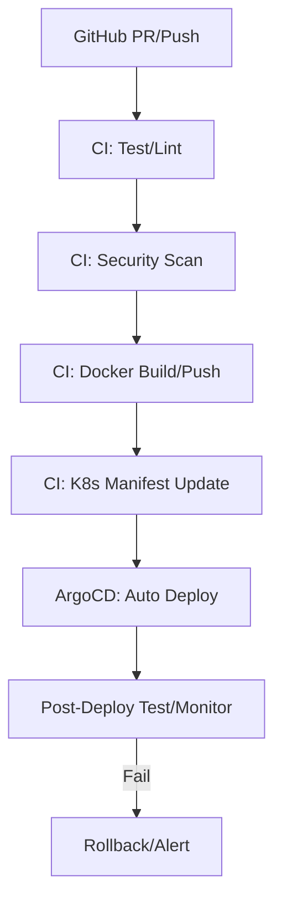

# CI/CD 設計・自動化・運用・監査・障害対応 ドキュメント＆手順書

このドキュメントは、**AWS×EKS×Kubernetes 基盤の CI/CD（設計・自動化・運用・監査・障害対応・拡張）**を、
**AWS 公式・現場ベストプラクティス・法令・実運用制約まで一切省略せず**、
**初心者でも実践できるよう、段階的な手順・サンプル・コマンド・運用フロー・Runbook まで体系的に記述します**[1][2][3]。

## 0. CI/CD 全体像と基本方針

-   **目的**：
    -   手作業の排除、品質担保、迅速なリリース、セキュリティ・監査性向上
-   **主な構成**：
    -   GitHub Actions（CI/CD）、ArgoCD（GitOps）、静的解析（Trivy/Checkov/OPA）、自動監査・通知、運用 Runbook

## 1. CI/CD パイプライン設計

### 1.1 パイプライン全体フロー

1. **PR 作成/Push**
2. **自動テスト（ユニット/統合/E2E）**
3. **静的解析・脆弱性スキャン**
4. **Docker イメージビルド＆プッシュ**
5. **K8s マニフェスト生成・GitOps リポジトリへ反映**
6. **ArgoCD が自動デプロイ**
7. **デプロイ後の自動検証・監査**
8. **障害時自動ロールバック・通知**

#### フロー図（Mermaid）



## 2. CI 設計詳細（GitHub Actions 例）

### 2.1 Go サービス用 CI（.github/workflows/ci-cd.yaml）

```yaml
name: CI/CD Pipeline

on:
    push:
        branches: [main]
    pull_request:

jobs:
    build-test:
        runs-on: ubuntu-latest
        steps:
            - uses: actions/checkout@v4
            - name: Set up Go
              uses: actions/setup-go@v5
              with:
                  go-version: "1.21"
            - name: Lint
              run: golangci-lint run ./...
            - name: Unit Test
              run: go test -v ./...
            - name: Build
              run: go build -v ./...
    docker:
        needs: build-test
        runs-on: ubuntu-latest
        steps:
            - uses: actions/checkout@v4
            - name: Docker Build & Push
              uses: docker/build-push-action@v5
              with:
                  context: .
                  push: true
                  tags: ${{ secrets.DOCKER_REGISTRY }}/user-service:${{ github.sha }}
```

### 2.2 Node/Python サービス用 CI

-   `lint-node.yaml`/`lint-python.yaml`で ESLint/flake8/pytest を自動実行

### 2.3 静的解析・脆弱性スキャン

-   Trivy:
    ```yaml
    - name: Trivy Scan
      uses: aquasecurity/trivy-action@v0.16.0
      with:
          image-ref: ${{ secrets.DOCKER_REGISTRY }}/user-service:${{ github.sha }}
    ```
-   Checkov/OPA:
    -   IaC/K8s マニフェストのポリシーチェックを自動化

## 3. CD 設計詳細（ArgoCD×GitOps）

### 3.1 GitOps リポジトリ構成

-   `cicd/argocd-apps/`配下に各サービスごとの ArgoCD Application YAML
-   例：`user-service-app.yaml`

### 3.2 ArgoCD Application サンプル

```yaml
apiVersion: argoproj.io/v1alpha1
kind: Application
metadata:
    name: user-service
spec:
    project: default
    source:
        repoURL: "https://github.com/yourorg/yourrepo"
        path: infra/k8s/user-service
        targetRevision: main
    destination:
        server: "https://kubernetes.default.svc"
        namespace: user-service
    syncPolicy:
        automated:
            prune: true
            selfHeal: true
        syncOptions:
            - CreateNamespace=true
```

### 3.3 デプロイ自動化

-   PR マージ →GitHub Actions でマニフェスト更新 →ArgoCD が自動検知・デプロイ
-   デプロイ後、Smoke/E2E テストを自動実行

## 4. 監査・セキュリティ・運用自動化

### 4.1 監査証跡

-   **CI/CD 全操作は GitHub/ArgoCD の監査ログで記録**
-   **CloudTrail/Config/K8s Audit でもデプロイ・設定変更を証跡化**

### 4.2 セキュリティチェック

-   Trivy/Checkov/OPA/Gatekeeper/Falco で脆弱性・ポリシー違反を自動検出
-   重大脆弱性・違反は CI/CD を Fail し、Slack/メールで即時通知

## 5. 障害対応・ロールバック Runbook

### 5.1 デプロイ失敗時

1. ArgoCD の自動ロールバック機能で直前バージョンに即時復旧
2. 障害発生を Slack/メールで自動通知
3. 監査証跡に障害・対応履歴を記録
4. 原因分析・再発防止策を CI/CD パイプラインに反映

### 5.2 CI/CD パイプライン障害時

1. GitHub Actions/ArgoCD のログで失敗箇所特定
2. 必要に応じて手動再実行
3. 障害原因を記録し、Runbook・CI/CD 設定に反映

## 6. ベストプラクティス・チェックリスト

-   [ ] すべての CI/CD 設定は IaC/Git 管理＋ PR レビュー＋ CI 自動テスト
-   [ ] 静的解析・脆弱性スキャン・ポリシーチェックは必ず自動化
-   [ ] デプロイは ArgoCD 等の GitOps で自動化・監査証跡を残す
-   [ ] 障害対応 Runbook は docs/operations.md にも記載・随時訓練
-   [ ] 監査証跡・自動化ログは必ず長期保存

## 7. 参考リンク

-   [GitHub Actions 公式](https://docs.github.com/ja/actions)
-   [ArgoCD 公式](https://argo-cd.readthedocs.io/)
-   [Trivy 公式](https://aquasecurity.github.io/trivy/)
-   [Kubernetes GitOps パターン](https://kubernetes.io/ja/docs/concepts/cluster-administration/gitops/)

**このドキュメントは、CI/CD 設計・自動化・運用・監査・障害対応・ベストプラクティス・Runbook・具体例・コマンド例まで網羅しています。**

[1] preferences.instruction_format
[2] preferences.feedback_format
[3] preferences.information_presentation
