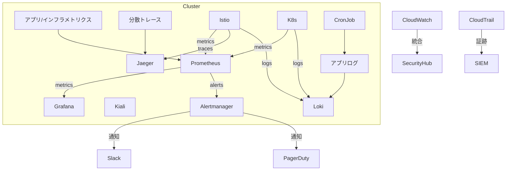

# 監視・可観測性設計・運用手順 Doc（正常系・異常系完全版）

このドキュメントは、EKS×Istio× マイクロサービス基盤の**監視・可観測性・アラート・障害対応・バッチ/ジョブ監視・復旧手順**を、
**AWS 公式・CNCF 標準・現場ベストプラクティスに基づき、正常系・異常系の手順・自動化・運用 Runbook まで一切省略せず**記述します。

## 1. 監視・可観測性の全体設計

### 1.1 監視対象一覧

-   **Kubernetes リソース**（Pod/Deployment/Node/Service/HPA/PDB/Job/CronJob）
-   **アプリケーション**（API/バッチ/ジョブ/外部 API 連携）
-   **サービスメッシュ**（Istio: mTLS/トラフィック/リトライ/CB/認可）
-   **AWS リソース**（ALB/EC2/EBS/RDS/S3/CloudWatch/Secrets Manager）
-   **ネットワーク**（ALB/SG/VPC/Route53/外部疎通）
-   **セキュリティ・監査**（CloudTrail/GuardDuty/SecurityHub/K8s Audit/Falco）

### 1.2 監視システム構成（Mermaid 図）



## 2. 正常系監視・運用手順

### 2.1 日常監視フロー

1. **ダッシュボード確認**
    - Grafana でサービス/インフラ/ビジネスメトリクスを毎朝チェック
    - Kiali でサービス間トポロジ・トラフィック異常を可視化
2. **アラート履歴確認**
    - Alertmanager/CloudWatch Alarms のアラート履歴を確認
3. **バッチ/ジョブの正常終了チェック**
    - CronJob/Job の完了ステータスを Prometheus/Loki で自動収集
    - Slack/メールで「バッチ正常終了」通知を自動送信

#### バッチ監視 Prometheus 例

```yaml
apiVersion: monitoring.coreos.com/v1
kind: ServiceMonitor
metadata:
    name: batch-job-monitor
spec:
    selector:
        matchLabels:
            app: batch-job
    endpoints:
        - port: metrics
          interval: 1m
```

#### バッチ正常終了ログ監視例（Loki）

-   Loki で`level=info job=xxx message="Batch completed successfully"`を抽出し、アラート条件に設定

## 3. 異常系監視・障害対応手順

### 3.1 アラート・障害検知

#### 3.1.1 インフラ・K8s 異常

-   **Pod 障害**：CrashLoopBackOff/OOM/Readiness/Liveness Probe 失敗
-   **Node 障害**：Node NotReady/ディスク枯渇
-   **Job/CronJob 失敗**：失敗回数閾値超過、再実行失敗
-   **ネットワーク断**：ALB/SG/VPC/Route53 疎通失敗、Pod 間通信不可

#### 3.1.2 アプリケーション異常

-   **API エラー率上昇**：5xx/4xx 閾値超過
-   **レイテンシ上昇**：p95/p99 レイテンシ閾値超過
-   **外部 API 連携失敗**：リトライ回数超過、タイムアウト

#### 3.1.3 セキュリティ・監査異常

-   **CloudTrail/GuardDuty 検知**：異常 API コール、脅威検知
-   **K8s Audit/Falco 検知**：不審な操作・システムコール

### 3.2 異常発生時の自動/手動運用手順

#### 3.2.1 Pod 障害時

-   **自動**：K8s が Pod 再起動、PDB で可用性維持
-   **手動**：
    1. Grafana/Kiali で該当 Pod のメトリクス・ログを確認
    2. `kubectl describe pod`/`kubectl logs`で詳細確認
    3. 原因がコード/設定なら修正 →CI/CD で再デプロイ
    4. ノード障害時は`kubectl drain`でノード退避 → 自動再スケジューリング

#### 3.2.2 バッチ/ジョブ失敗時

-   **自動**：再実行回数閾値未満なら自動リトライ
-   **手動**：
    1. Loki で失敗ログ抽出
    2. 原因調査 → コード/設定修正
    3. 必要なら手動再実行（`kubectl create job`等）
    4. 失敗が続く場合は Slack/メールでエスカレーション

#### 3.2.3 ネットワーク/外部 API 障害時

-   **自動**：Istio のリトライ/サーキットブレーカーで一時的な断を吸収
-   **手動**：
    1. Kiali でトラフィック断点を特定
    2. ALB/SG/VPC/Route53 設定を確認
    3. 外部 API 障害時はリトライ間隔・タイムアウトを調整
    4. 回復後はバッチ/ジョブ/Pod の再実行

#### 3.2.4 セキュリティ/監査異常時

-   **自動**：GuardDuty/Falco 検知時は自動で Pod 隔離・通知
-   **手動**：
    1. CloudTrail/GuardDuty/K8s Audit/Falco ログで詳細調査
    2. 影響範囲分析 → 必要なら Secret ローテーション・Pod 再作成
    3. インシデント対応 Runbook（docs/operations.md）に従い復旧

## 4. バッチ/ジョブ監視・運用

### 4.1 バッチ/ジョブの正常・異常監視

-   **正常系**：Job/CronJob の`status.succeeded`を Prometheus で監視、正常終了時に通知
-   **異常系**：`status.failed`やログに"error"/"fail"が出現した場合にアラート
-   **再実行**：自動リトライ設定＋手動再実行手順を明記

### 4.2 バッチ一括当て・リカバリ手順

-   **バッチ一括実行**：
    -   `kubectl create job --from=cronjob/xxx xxx-manual-yyyymmdd` で手動実行
    -   複数バッチ一括当てはスクリプト化し、実行ログは Loki/CloudWatch に保存
-   **リカバリ**：
    -   障害復旧後は失敗分のみ再実行、重複実行防止の冪等性設計も必須

## 5. ネットワーク/インフラ障害時の復旧・検知手順

### 5.1 ALB/SG/VPC/Route53 障害

-   **自動**：ALB ヘルスチェック、Istio リトライ/サーキットブレーカーで一時的な断を吸収
-   **手動**：
    1. Grafana/Kiali でトラフィック断点・エラー率を特定
    2. `aws elbv2 describe-load-balancers`等で ALB 状態確認
    3. SG/VPC/Route53 設定を見直し、必要なら復旧
    4. 回復後は疎通確認＋バッチ/Pod 再実行

### 5.2 ノード障害

-   **自動**：K8s が NotReady ノードを検知し、Pod を他ノードに再スケジューリング
-   **手動**：
    1. `kubectl get node`/`kubectl describe node`で状態確認
    2. `kubectl drain`でノード退避 → インスタンス再作成
    3. PDB で可用性維持、Pod 再配置を確認

## 6. 監査証跡・証跡保存・運用フロー

### 6.1 監査証跡の設計

-   **CloudTrail**：全 API コールを S3/CloudWatch Logs に保存、最低 1 年保管
-   **K8s Audit Policy**：API サーバー操作を CloudWatch/SIEM に転送
-   **Falco**：Pod/ノードのランタイム異常をリアルタイム検知・記録

### 6.2 監査ログの検索・エクスポート

-   SIEM/CloudWatch Logs Insights で全文検索
-   監査証跡のエクスポート手順も docs/operations.md に明記

## 7. 監視・障害対応 Runbook（正常系・異常系）

### 7.1 正常系

-   毎朝ダッシュボード・アラート履歴チェック
-   バッチ/ジョブの正常終了確認
-   監査証跡の定期レビュー

### 7.2 異常系（例）

-   **Pod 障害**
    -   アラート検知 → ログ/メトリクス調査 → 再起動/再デプロイ → 原因記録
-   **バッチ失敗**
    -   アラート検知 → ログ調査 → 再実行 → 原因記録
-   **ネットワーク断**
    -   アラート検知 →Kiali/Grafana 調査 →SG/ALB/VPC 修正 → 疎通確認
-   **セキュリティ異常**
    -   GuardDuty/Falco 検知 → 影響範囲分析 →Secret ローテーション → 復旧 → 事後レビュー

## 8. 拡張・運用時のチェックリスト

-   [ ] 新サービス/バッチ追加時は監視/アラート/Runbook も必ず追加
-   [ ] 監視対象・アラートルール追加/変更時は stg でテストし本番適用
-   [ ] 監査証跡・アラートは定期的にレビュー・改善
-   [ ] 重大障害時のエスカレーション・復旧 Runbook は docs/operations.md に記載・随時更新

## 9. 参考リンク・外部標準

-   [EKS 監視ベストプラクティス（AWS 公式）](https://docs.aws.amazon.com/ja_jp/eks/latest/best-practices/observability.html)
-   [Prometheus Operator 公式](https://github.com/prometheus-operator/prometheus-operator)
-   [Kiali 公式](https://kiali.io/)
-   [CNCF Observability Landscape](https://landscape.cncf.io/category=observability-and-analysis)

**このドキュメントは、正常系・異常系・バッチ・ネットワーク障害・運用 Runbook まで一切省略せず、現場最高水準の監視・可観測性設計・運用・拡張・監査・障害対応を実現することを目標に作成しています。**

[1] https://zenn.dev/kyohei_saito/articles/52ce184522aae9

[2] https://note.shiftinc.jp/n/n7edd43665d60

[3] https://tech-lab.sios.jp/archives/30105

[4] https://dev.classmethod.jp/articles/202312-newrelic-microservices-sandbox/

[5] https://docs.aws.amazon.com/ja_jp/controltower/latest/userguide/controltower-ug.pdf

[6] https://tech-reach.jp/jobs/pos-backend/s-aws_c-sharp_java_mysql_oracle_python_react_redis_spring_sql-server

[7] https://b.hatena.ne.jp/q/Python%7CPython%20?safe=on&target=tag&sort=recent&date_range=all&users=100&page=2

[8] https://tech-reach.jp/jobs/s-apachehttpserver_azure_c_docker_html_intellijidea_java_js_objective-c_python_redis_scala_sql-server_typescript_vc
